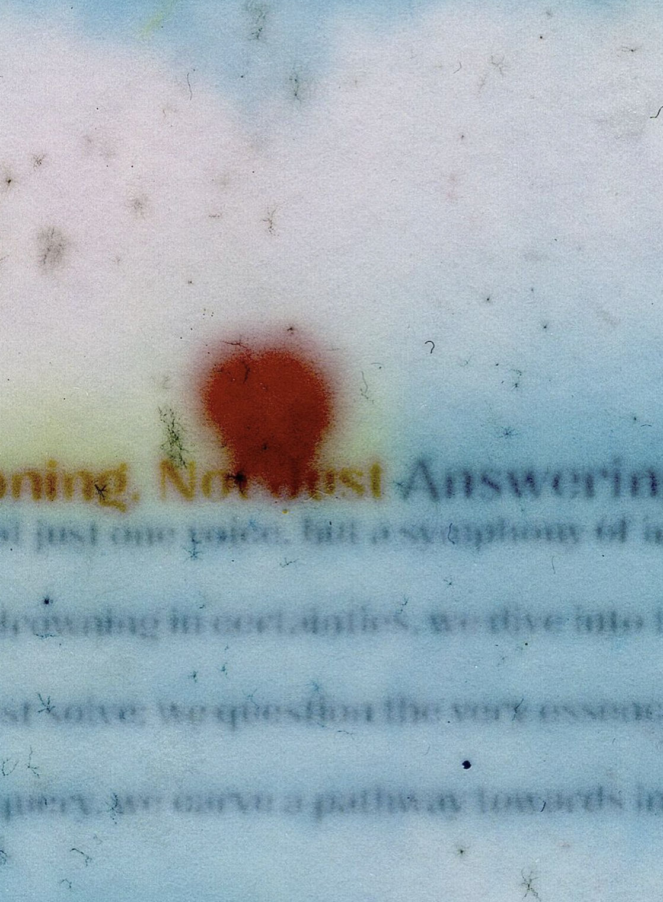

- 👋 Hi, I’m @waterlike
- 👀 interested in water, communication, future
- 🌱 currently learning community
- 💞️ looking to collaborate on diy solutions and tools for creatives
- 📫 reach me @waterlike.world

<!---
watelike/watelike is a ✨ special ✨ repository because its `README.md` (this file) appears on your GitHub profile.
You can click the Preview link to take a look at your changes.
--->

background is done using 
O- Frame Minimal WebGL library
(https://github.com/oframe/ogl/archive/master.zip)
